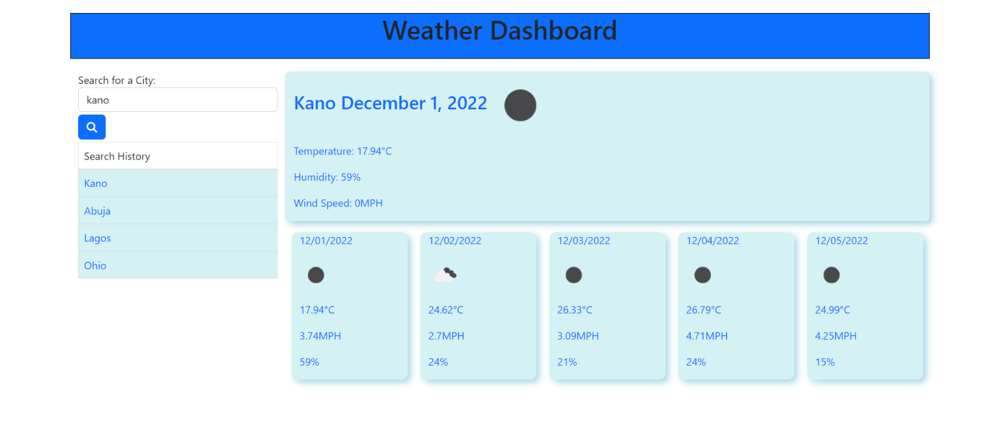

# Weather-Dashboard
## Description
A weather dashboard that displays current and future 5-day weather forecast of cities.

Below is how the application works:
* When a user searches for a city, he is presented with the city name, the date, an icon representation of weather conditions, the temperature, the humidity, and the the wind speed
* When user views future weather conditions for a city, he is presented with a 5-day forecast that displays the date, an icon representation of weather conditions, the temperature, the wind speed, and the humidity
* When user clicks on a city in the search history, he is again presented with current and future conditions for that city

## URLs

## Technologies used
HTML, Bootstrap, CSS, Jquery, Javascript

## License
This project is licensed under the MIT License.